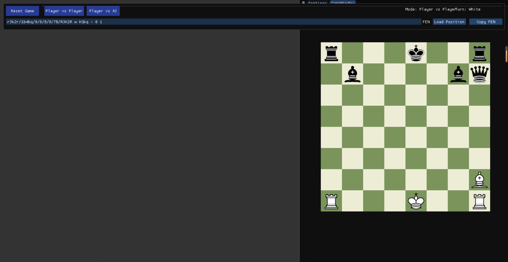

# Chess AI Implementation Project


## 🎯 Project Overview
This repository contains a skeleton implementation of a Chess AI engine written in C++. The project is designed to teach fundamental concepts of game AI, including board representation, move generation, and basic game tree search algorithms.

### 🎓 Educational Purpose
This project serves as a teaching tool for computer science students to understand:
- Game state representation
- Object-oriented design in C++
- Basic AI concepts in game playing
- Bitboard operations and chess piece movement
- FEN (Forsyth–Edwards Notation) for chess position representation

## 🔧 Technical Architecture

### Key Components
1. **Chess Class**: Core game logic implementation
   - Board state management
   - Move validation
   - Game state evaluation
   - AI player implementation

2. **Piece Representation**
   - Unique identifiers for each piece type
   - Sprite loading and rendering
   - Movement pattern definitions

3. **Board Management**
   - 8x8 grid representation
   - Piece positioning
   - Move history tracking
   - FEN notation support

## 🚀 Getting Started

### Prerequisites
- C++ compiler with C++11 support or higher
- Image loading library for piece sprites
- CMake 3.10 or higher

### Building the Project
```bash
mkdir build
cd build
cmake ..
make
```

### Running Tests
```bash
./chess_tests
```

## 📝 Implementation Details

### Current Features
- Basic board setup and initialization
- Piece movement validation framework
- FEN notation parsing and generation
- Sprite loading for chess pieces
- Player turn management

### Planned Features
- [ ] AI move generation
- [ ] Position evaluation
- [ ] Opening book integration
- [ ] Advanced search algorithms
- [ ] Game state persistence

## 🔍 Code Examples

### Piece Movement Validation
```cpp
bool Chess::canBitMoveFromTo(Bit& bit, BitHolder& src, BitHolder& dst) {
    // TODO: Implement piece-specific movement rules
    return false;
}
```

### FEN Notation Generation
```cpp
const char Chess::bitToPieceNotation(int row, int column) const {
    if (row < 0 || row >= 8 || column < 0 || column >= 8) {
        return '0';
    }
    // Implementation details for FEN notation
}
```

## 📚 Class Assignment Structure

### Phase 1: Board Setup
- Implement piece placement
- Setup initial board state
- Validate board representation

### Phase 2: Move Generation
- Implement basic piece movements
- Add move validation
- Implement special moves (castling, en passant)

### Phase 3: AI Implementation
- Develop position evaluation
- Implement minimax algorithm
- Add alpha-beta pruning
- Basic opening book

## 🤝 Contributing
Students are encouraged to:
1. Fork the repository
2. Create a feature branch
3. Implement assigned components
4. Submit their fork for review

## 🔒 Code Style and Standards
- Use consistent indentation (4 spaces)
- Follow C++ naming conventions
- Document all public methods
- Include unit tests for new features

## 📄 License
This project is licensed under the MIT License.

## 👥 Contributors
- [Your Name] - Initial work
- [Student Names] - Implementation and testing

## 🙏 Acknowledgments
- Chess piece sprites from [Wikipedia](https://en.wikipedia.org/wiki/Chess_piece)
- Original game engine framework by [ocornut](https://github.com/ocornut/imgui)

---
*This README is part of an educational project and is intended to serve as an example of good documentation practices.*

---

## Technical Documentation

### 1. Core Class Structure:

Entity (Base Class)
  |- Sprite (Inherits from Entity)
      |- Bit (Chess Piece Class, Inherits from Sprite) 
      |- BitHolder (Chess Square Class, Inherits from Sprite)
          |- ChessSquare (Chess Square, Inherits from BitHolder)
          
Game (Game Base Class)
  |- Chess (Chess Class, Inherits from Game)

### 2. Main Functional Modules:
#### Board Initialization and Rendering:
* Chess::setUpBoard() - Initialize board and pieces
* Game::drawFrame() - Render board and pieces

#### Piece Movement System:
Game::mouseDown/mouseMoved/mouseUp - Handle piece dragging
BitHolder::canDropBitAtPoint - Validate piece placement
* Chess::canBitMoveFromTo - Validate legal piece movement

#### Turn Management:
* Game::endTurn - End current turn
* Player Class - Manage player information and turns
FEN Notation:
* Chess::stateString - Generate FEN string
* Chess::setStateString - Restore game state from FEN string

#### Rendering System:
* Using ImGui for UI rendering
Using OpenGL for board and piece rendering
* Sprite class handles texture loading and rendering

### 3. Chess Rules Implementation:

#### Basic Rule Validation:
* canBitMoveFromTo() - Validate move legality
* getLegalMoves() - Get all legal moves
* isSquareUnderAttack() - Check if square is under attack
* isPieceBlocking() - Check if path is blocked
* checkPawnPromotion() - Check pawn promotion
* showPromotionDialog() - Display pawn promotion dialog
* promotePawnTo() - Execute pawn promotion

King's Highlighted Movement Rules:
* King cannot move to squares under attack

#### Special Rules Implementation:

##### Castling:
* CastlingRights struct - Record castling rights
* canCastle() - Check castling conditions:
  - King and rook haven't moved
  - No pieces between them
  - King doesn't pass through attacked squares
  - King is not in check
* Implementation handled in bitMovedFromTo

##### En Passant:
* EnPassantState struct - Record en passant state
* Condition checks:
  - Pawn's first two-square move
  - Opponent's pawn in correct position
  - Must capture immediately
* Add possible en passant moves in getBasicLegalMoves

#### AI Implementation:
* Minimax algorithm (findBestMove/minimax functions)
* Alpha-Beta pruning optimization
* Evaluation function (evaluatePosition):
  - Basic piece values
  - Position value tables
  - Mobility assessment
  - Center control
  - King safety

#### Win/Loss Detection:
* Check detection (isInCheck)
* Checkmate detection (isCheckmate):
  - Check if king is in check
  - Check for legal moves
  - Check if attacking piece can be captured
  - Check if attack can be blocked
* Draw conditions:
  - Stalemate
  - Repetition
  - 50-move rule

#### State Management:
* GameStatus - Game state management
* LastMoveState - Record last move
* Turn switching (_isWhiteTurn)
* Move history recording

#### Interface Feedback:
* Legal move hints
* Check indicators
* Game end notifications
* Move animations

### 4. FEN (Forsyth–Edwards Notation) Support:

#### FEN String Format:
FEN string consists of 6 fields, space-separated:
1. Board layout
2. Active color (w/b)
3. Castling availability (KQkq)
4. En passant target square
5. Halfmove clock
6. Fullmove number

#### Implementation Methods:
* FENtoBoard() - Convert FEN string to board state
  - Parse board layout
  - Set active color
  - Set castling rights
  - Set en passant state
  - Set move counters

* BoardtoFEN() - Convert current board state to FEN string
  - Generate board layout string
  - Add active color
  - Add castling rights
  - Add en passant information
  - Add move counters

#### Test Cases:
Specific position FEN strings:
* Initial position: 
  "rnbqkbnr/pppppppp/8/8/8/8/PPPPPPPP/RNBQKBNR w KQkq - 0 1"
* White kingside castle: 
  "5K2/8/8/8/8/8/8/4K2R w K - 0 1"
* White queenside castle: 
  "3k4/8/8/8/8/8/8/R3K3 w Q - 0 1"
* Both sides can castle: 
  "r3k2r/1b4bq/8/8/8/8/7B/R3K2R w KQkq - 0 1"
* White pawn promotion: 
  "2K2r2/4P3/8/8/8/8/8/3k4 w - - 0 1"
* En passant: 
  "rnbqkbnr/ppp1p1pp/8/3pPp2/8/8/PPPP1PPP/RNBQKBNR w KQkq f6 0 1"

### Live Demonstration


