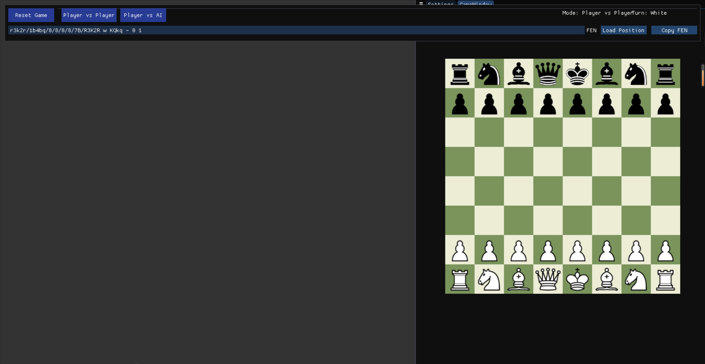
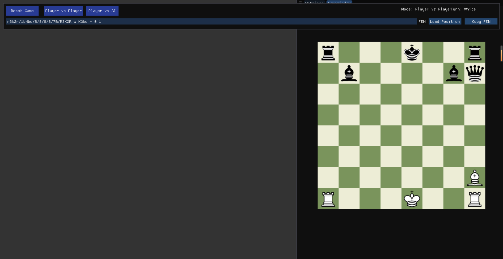

## 1. 核心类结构:

Entity (基类)
  |- Sprite (继承自Entity)
      |- Bit (棋子类,继承自Sprite) 
      |- BitHolder (棋格类,继承自Sprite)
          |- ChessSquare (国际象棋棋格,继承自BitHolder)
          
Game (游戏基类)
  |- Chess (国际象棋类,继承自Game)

## 2. 主要功能模块:
### 棋盘初始化和渲染:
* Chess::setUpBoard() - 初始化棋盘和棋子
* Game::drawFrame() - 渲染棋盘和棋子

### 棋子移动系统:
Game::mouseDown/mouseMoved/mouseUp - 处理拖拽棋子
BitHolder::canDropBitAtPoint - 验证棋子是否可以放置
* Chess::canBitMoveFromTo - 验证棋子移动是否合法

### 回合管理:
* Game::endTurn - 结束当前回合
* Player类 - 管理玩家信息和回合
FEN表示:
* Chess::stateString - 生成FEN字符串
* Chess::setStateString - 从FEN字符串恢复棋局

### 渲染系统:
* 使用ImGui进行UI渲染
使用OpenGL进行棋盘和棋子的渲染
* Sprite类处理纹理加载和渲染

## 3. 国际象棋规则实现:

### 基本规则验证:
* canBitMoveFromTo() - 验证移动合法性
* getLegalMoves() - 获取所有合法移动
* isSquareUnderAttack() - 检查格子是否被攻击
* isPieceBlocking() - 检查路径是否被阻挡
* checkPawnPromotion() - 检查兵升变
* showPromotionDialog() - 显示兵升变对话框
* promotePawnTo() - 执行兵升变
* 

王的高亮移动规则：
* 王不能移动到被攻击的格子

### 特殊规则实现:

#### 王车易位(Castling):
* CastlingRights结构体 - 记录王车易位权限
* canCastle() - 检查王车易位条件:
  - 王和车未移动过
  - 中间格子无棋子
  - 王经过的格子未被攻击
  - 王不在被将军状态
* 实现过程在bitMovedFromTo中处理

#### 吃过路兵(En Passant):
* EnPassantState结构体 - 记录过路兵状态
* 条件检查:
  - 兵首次移动两格
  - 对方兵在正确位置
  - 必须立即吃掉
* 在getBasicLegalMoves中添加可能的吃过路兵移动

### AI实现:
* Minimax算法 (findBestMove/minimax函数)
* Alpha-Beta剪枝优化
* 评估函数(evaluatePosition):
  - 基础棋子价值
  - 位置价值表
  - 机动性评估
  - 中心控制
  - 王的安全

### 胜负判定:
* 将军检测(isInCheck)
* 将死检测(isCheckmate):
  - 检查王是否被将军
  - 检查是否有合法移动
  - 检查是否可以吃掉攻击棋子
  - 检查是否可以阻挡攻击
* 和棋情况:
  - 双方无子可动
  - 重复局面
  - 50步未吃子

### 状态管理:
* GameStatus - 游戏状态管理
* LastMoveState - 记录最后一步移动
* 回合切换(_isWhiteTurn)
* 移动历史记录

### 界面反馈:
* 合法移动提示
* 将军提示
* 游戏结束提示
* 移动动画效果

## 4. FEN(Forsyth–Edwards Notation)支持:

### FEN字符串格式:
FEN字符串由6个字段组成，以空格分隔：
1. 棋盘布局
2. 当前行动方 (w/b)
3. 王车易位权限 (KQkq)
4. 吃过路兵目标格
5. 半回合数
6. 全回合数

### 实现方法:
* FENtoBoard() - 将FEN字符串转换为棋盘状态
  - 解析棋盘布局
  - 设置当前行动方
  - 设置王车易位权限
  - 设置吃过路兵状态
  - 设置回合计数

* BoardtoFEN() - 将当前棋盘状态转换为FEN字符串
  - 生成棋盘布局字符串
  - 添加当前行动方
  - 添加王车易位权限
  - 添加吃过路兵信息
  - 添加回合计数

### 测试用例:
特定局面的FEN字符串：
* 初始局面: 
  "rnbqkbnr/pppppppp/8/8/8/8/PPPPPPPP/RNBQKBNR w KQkq - 0 1"
* 白方王翼易位: 
  "5K2/8/8/8/8/8/8/4K2R w K - 0 1"
* 白方后翼易位: 
  "3k4/8/8/8/8/8/8/R3K3 w Q - 0 1"
* 双方可易位: 
  "r3k2r/1b4bq/8/8/8/8/7B/R3K2R w KQkq - 0 1"
* 白兵升变: 
  "2K2r2/4P3/8/8/8/8/8/3k4 w - - 0 1"
* 吃过路兵: 
  "rnbqkbnr/ppp1p1pp/8/3pPp2/8/8/PPPP1PPP/RNBQKBNR w KQkq f6 0 1"

## 实机演示

